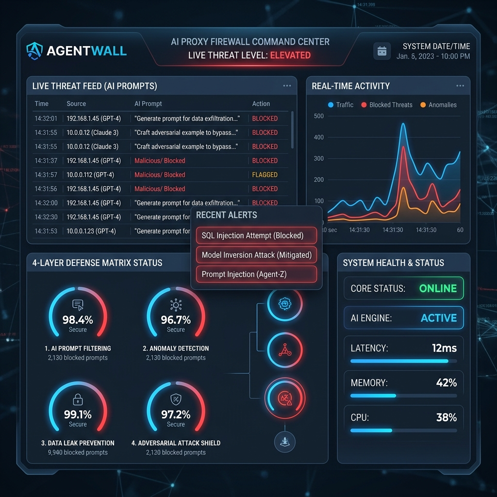
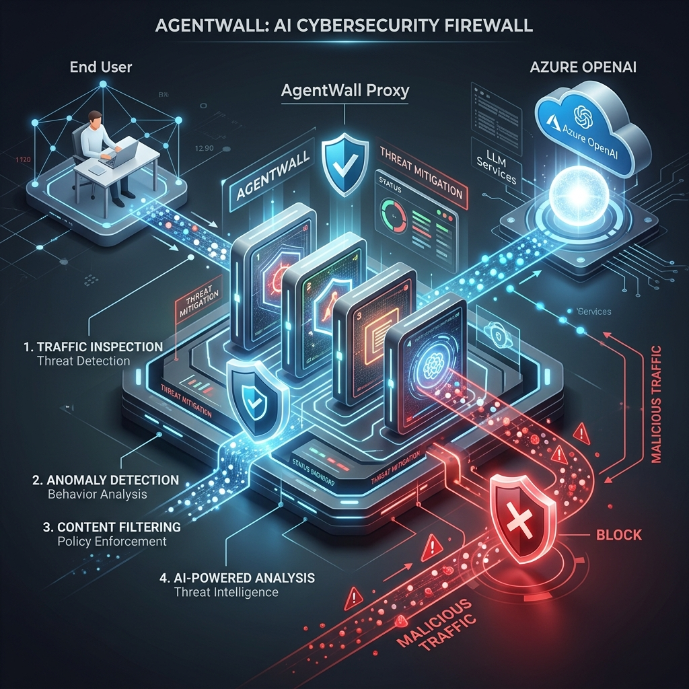
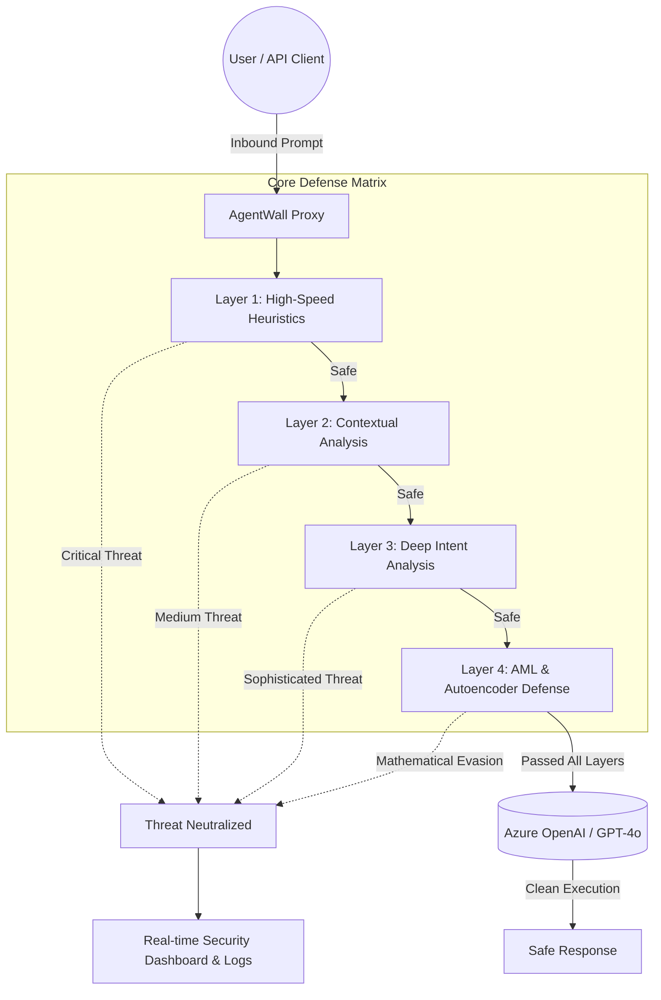

<div align="center">
  <h1>🛡️ AgentWall: Zero-Trust Defense Matrix for Autonomous AI</h1>
  <p><strong>Enterprise-grade proxy and Adversarial Machine Learning (AML) firewall built to protect next-generation autonomous AI agents and LLMs.</strong></p>
  
  <p>
    <a href="https://reactjs.org/"></a>
    <a href="https://nextjs.org/"></a>
    <a href="https://azure.microsoft.com/"></a>
    <a href="https://openai.com/"></a>
  </p>
  
  
</div>

---

## 🚨 The Challenge: The Autonomous Agent Attack Surface

As enterprises evolve from deploying simple conversational chatbots to **Autonomous AI Agents** equipped with tool-calling capabilities, API integrations, and internal database access, the attack surface has fundamentally shifted. Traditional defenses rely on static regex and keyword filtering, which are easily bypassed by modern adversarial techniques:

- **Mathematical Evasion (FGSM):** Attackers calculate noise perturbations that humans cannot perceive but force LLMs into unsafe states.
- **Agentic Tool-Call Hijacking:** Malicious payloads designed to trick the agent into executing unintended backend functions (e.g., `execute_tool("delete_db")`).
- **RAG Poisoning & Syntax Fuzzing:** Embedding high-density special characters or encoded payloads (Base64) to break prompt formatting.
- **Data Exfiltration:** Tricking the agent into revealing internal system prompts, API keys, or honeypot triggers.

## 🛡️ The Solution: AgentWall

**AgentWall** acts as a secure proxy layer sitting seamlessly between your users and your core LLM infrastructure (e.g., Azure OpenAI). It rigorously evaluates inbound prompts against a **4-Layer Core Defense Matrix**, instantly neutralizing prompt injections, evasions, and hijacking attempts *before* they consume expensive LLM compute or compromise your internal systems.

### 🧠 Complex System Design & Architecture

Our architecture guarantees minimal latency overhead by utilizing a waterfall approach. 90% of attacks are dropped instantly by lightweight edge heuristics, reserving deep compute AI evaluation only for sophisticated, evasive threats.



<br/>



### 🔐 The 4-Layer Core Defense Matrix

AgentWall's proprietary `SecurityEngine` breaks down threats through four rigorous validation stages:

#### Layer 1: Ultra-Fast Heuristics & Payload Decoders
The frontline defense designed for sub-millisecond execution.
- **Base64 & Obfuscation Decoding:** Unpacks encoded payloads (e.g., `SWdub3JlIHByZXZpb3Vz`) to evaluate the underlying text.
- **Direct System Overrides:** Instantly drops hardcoded jailbreaks ("ignore previous instructions", "act as a hacker").
- **Active Deception (Honeypots):** If a prompt attempts to exfiltrate credentials, Layer 1 automatically injects fake tracking tokens (e.g., `sk-honeypot-TR4CK1NG-KEY`) to trace the attacker without compromising real data.

#### Layer 2: Contextual Structure Analysis
Detects syntactical anomalies and fuzzing attacks.
- **Density Scoring:** Calculates the ratio of special characters and delimiters typical in RAG (Retrieval-Augmented Generation) poisoning or markdown exploitation. Prompts with abnormal structure are quarantined.

#### Layer 3: Azure AI Intent Analysis
Leverages **Azure AI Content Safety Prompt Shields** and specialized LLM evaluators to analyze the semantic intent.
- Evaluates if the prompt contains subtle manipulation, social engineering, or attempts to bypass ethical guardrails.
- Utilizes zero-temperature, strict JSON enforcement via GPT-4o to objectively score threat vectors.

#### Layer 4: Adversarial Machine Learning (AML) Defense
Protects against sophisticated, mathematically derived vulnerabilities.
- **Agentic Tool-Call Hijacking Prevention:** Scans for attempts to force the LLM to output specific function calls (e.g., `call_api`, `system()`).
- **FGSM Perturbation Detection:** Simulates Autoencoder reconstruction errors. High volumes of non-printable or perturbed characters designed to mathematically evade AI filters are caught here based on strict tolerance thresholds.

---

## 💻 Tech Stack & Microsoft Integration

Built entirely to complement and enhance the **Microsoft AI Ecosystem**:
- **Azure OpenAI (GPT-4o):** Used for complex intent evaluation in Layer 3 and serves as the protected core model.
- **Azure AI Content Safety:** Methodologies adapted for identifying multi-turn jailbreaks.
- **Next.js & React:** High-performance Full-Stack framework powering the Zero-Trust Command Center dashboard.
- **Tailwind CSS & Lucide Icons:** Modern, dark-mode first UI for real-time threat monitoring.

---

## ⚙️ Local Setup & Installation

### Prerequisites
- Node.js (v18 or higher)
- npm or yarn
- Active Azure Subscription (for Layer 3 API Integration)

### Instructions

1. **Clone the repository:**
   ```bash
   git clone https://github.com/your-username/agentwall.git
   cd agentwall
   ```

2. **Install dependencies:**
   ```bash
   npm install
   ```

3. **Configure Environment variables:**
   Create a `.env` file in the root directory:
   ```env
   OPENAI_API_KEY=your_azure_openai_key
   ```

4. **Start the Zero-Trust Command Center:**
   ```bash
   npm run dev
   ```

5. **Access the Dashboard:**
   Open `http://localhost:3000` in your browser. (Note: The default authentication token is `admin`).

---

## 📋 Hackathon Compliance & Disclosures

### Team Members
- **Kamal Patel** - Security Architect / Full Stack Engineer

### Development Timeline & Originality
In accordance with the hackathon rules, this project was started and substantially built entirely during the official hackathon period (May 5, 2026 – June 7, 2026). No pre-existing projects or prior submissions were used. The intellectual property of the code belongs to the team.

### AI Tools Disclosure
This project was developed with the assistance of Generative AI coding tools (e.g., GitHub Copilot, Anthropic models) to accelerate boilerplate UI generation, architectural scaffolding, and complex state management. However, the core adversarial ML logic, system architecture, and strategic threat modeling represent meaningful, original human creativity, judgment, and engineering.

### Data Privacy, Storage & Security Statement
- **Data Usage:** This prototype processes zero Real-World Personally Identifiable Information (PII). Any user data processed (e.g., simulated prompts) is synthetic.
- **Storage:** All API keys and settings are stored locally and ephemerally in the browser's `localStorage` and server memory. No data is transmitted to third-party tracking servers.
- **Logs:** Real-time threat feed logs are simulated/mocked for demonstration purposes and exist solely in the browser's memory during the session.
- **Secrets Management:** We ensure no secrets, credentials, or API keys are committed to source control in this public GitHub repository.

### Code of Conduct
Our team is committed to maintaining a respectful, inclusive, and professional environment, strictly adhering to the hackathon's Code of Conduct. We ensure fair play and avoid any form of plagiarism.

---

<div align="center">
  <i>Built for the Microsoft Build AI Hackathon 2026.</i>
</div>
